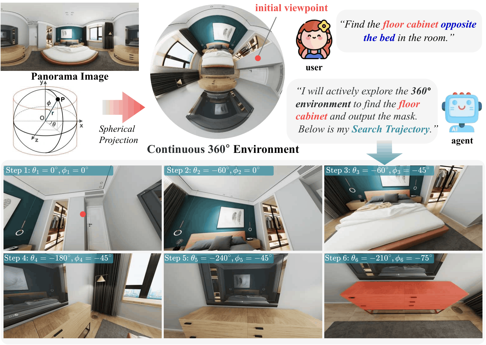
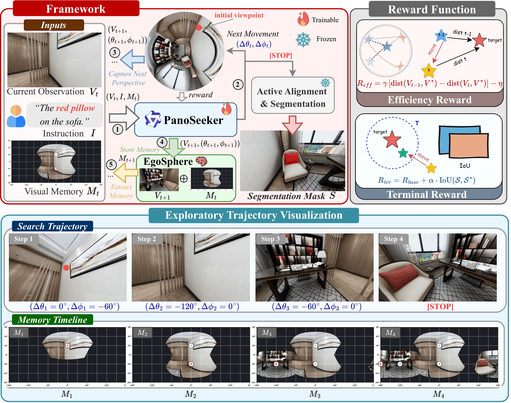

<div align="center">

# Seek to Segment: Active Perception for Panoramic Referring Segmentation

**[Song Tang](https://github.com/songtang209)<sup>1</sup>, [Shuming Hu](https://github.com/Hushuming727)<sup>1</sup>, [Xincheng Shuai](https://github.com/xinchengshuai)<sup>1</sup>, [Henghui Ding](https://henghuiding.com/)<sup>1†</sup>, [Yu-Gang Jiang](https://scholar.google.com/citations?user=f3_FP8AAAAAJ)<sup>2†</sup>**

<sup>1</sup>Institute of Big Data, College of Computer Science and Artificial Intelligence, Fudan University
<sup>2</sup>Institute of Trustworthy Embodied AI, Fudan University

<sup>†</sup>Corresponding authors

[](https://arxiv.org/abs/2607.02497v1)
[](https://henghuiding.com/APRS/)
[](https://huggingface.co/datasets/APRS)
[](LICENSE)

</div>

---

## 📖 Overview

We introduce **Active Panoramic Referring Segmentation (APRS)**, a novel task that requires agents to **actively explore** continuous 360° environments to seek and segment targets based on language instructions. Unlike passive referring segmentation methods that process static images, APRS agents must:

- 🔍 **Actively adjust viewing direction** (Δθ, Δφ) to explore panoramic scenes
- 🧠 **Reason about spatial relationships** across multiple viewpoints
- 🎯 **Locate and segment targets** specified by natural language instructions
- 💾 **Maintain spatial memory** to avoid redundant exploration

<div align="center">
  
  <p><i>Figure 1: APRS requires agents to actively explore 360° environments to find and segment targets based on language instructions.</i></p>
</div>

---

## 🌟 Key Features

- **Large-scale Benchmark**: 7,420 samples across 4,971 diverse indoor/outdoor panoramic scenes
- **Rich Spatial Language**: Four types of spatial referring expressions (Egocentric, Unique-Attribute, Allocentric, Multi-hop)
- **PanoSeeker Agent**: Vision-Language agent with EgoSphere spatial memory for efficient exploration
- **Training Pipeline**: Supervised Fine-Tuning on expert trajectories + Reinforcement Learning optimization
- **Comprehensive Evaluation**: Success Rate, Exploration Efficiency (SPL), and Segmentation Quality (mIoU)

---

## 🏗️ Method: PanoSeeker

**PanoSeeker** is a memory-augmented Vision-Language agent designed for efficient active perception in 360° environments.

### Core Components

**1. EgoSphere Memory**
Explicit spatial-visual memory that progressively maps sequential observations into a unified 360° panoramic canvas:
- Numbered markers showing visited viewpoints
- Dark/black regions indicating unexplored areas
- 30° latitude-longitude grid for precise angular estimation
- Red crosshair showing current viewing direction

**2. Intelligent Search Strategy**
- Semantic reasoning for object category constraints (ground objects vs ceiling objects)
- Visual context extraction from anchor objects and spatial relations
- Probability-guided decision making to prioritize high-likelihood unexplored regions
- Efficient movement planning with adaptive step sizes (120°/90°/60°/30°)

**3. Training Pipeline**
- **Supervised Fine-Tuning (SFT)**: Learn from expert-annotated search trajectories with memory timelines
- **Reinforcement Learning (RL)**: GRPO-based optimization with efficiency and terminal rewards
- **Active Alignment**: SAM-3 based viewpoint centering and segmentation

<div align="center">
  
  <p><i>Figure 2: PanoSeeker framework with EgoSphere memory and RL-based optimization.</i></p>
</div>

---

## 📦 Installation

### Requirements
- Python >= 3.11, < 3.13
- PyTorch 2.9.0 (for SAM-3 segmentation)
- CUDA (recommended for GPU acceleration)

### Install uv

[uv](https://github.com/astral-sh/uv) is a fast Python package installer and resolver, written in Rust.

```bash
# On macOS and Linux
curl -LsSf https://astral.sh/uv/install.sh | sh

# On Windows
powershell -c "irm https://astral.sh/uv/install.ps1 | iex"

# With pip
pip install uv
```

### Setup with uv (Recommended)

```bash
# Clone the repository
git clone https://github.com/FudanCVL/APRS.git
cd APRS

# Create virtual environment with Python 3.11
uv venv --python 3.11
source .venv/bin/activate  # On Windows: .venv\Scripts\activate

# Install core dependencies
uv pip install -e .
```

**Optional Components:**

```bash
# Install SAM-3 for segmentation (includes PyTorch 2.9.0, torchvision, timm, einops, scipy, scikit-image)
uv pip install -e ".[sam3]"

# Install 360° viewer (includes PyQt5, PyOpenGL)
uv pip install -e ".[viewer]"

# Install vLLM for inference acceleration (includes vllm>=0.11.0, transformers, accelerate, qwen-vl-utils)
uv pip install -e ".[vllm]"

# Install development tools (pytest, black, ruff, mypy)
uv pip install -e ".[dev]"

# Install all optional dependencies
uv pip install -e ".[all]"
```

**Quick Start - Install Everything:**

```bash
# One command to install all components
uv pip install -e ".[all]"
```

### Setup with pip

```bash
# Clone the repository
git clone https://github.com/FudanCVL/APRS.git
cd APRS

# Install core dependencies
pip install -e .

# Optional: Install with specific components
pip install -e ".[sam3]"       # SAM-3 segmentation
pip install -e ".[viewer]"     # 360° viewer
pip install -e ".[vllm]"       # vLLM inference
pip install -e ".[dev]"        # Development tools
pip install -e ".[all]"        # All components
```

---

## 🚀 Usage

### Download Dataset

**Option 1: Download from HuggingFace Hub**

```python
from aprs import APRSDataset

# Load dataset directly from HuggingFace
dataset = APRSDataset.from_hub(repo_id="FudanCVL/APRS_dataset", split="train")
sample = dataset[0]

# Access sample data
print(sample.instruction)       # Language instruction
print(sample.category)          # Spatial type: EGO/ALLO/UNIQ/MULTIHOP
print(sample.init_theta)        # Initial viewing direction (yaw)
print(sample.init_phi)          # Initial viewing direction (pitch)
image = sample.load_image()     # Load panoramic image (BGR numpy array)
```

**Option 2: Download dataset manually**

```bash
# Download from HuggingFace (requires git-lfs)
git lfs install
git clone https://huggingface.co/datasets/FudanCVL/APRS_dataset APRS_dataset
```

### Visualize Panoramas

```bash
# Launch interactive 360° viewer with HuggingFace dataset
uv run python tools/viewer_360.py --hf --split test --index 0

# Or load from local dataset
uv run python tools/viewer_360.py --root APRS_dataset --split test --index 0

# View standalone panorama
uv run python tools/viewer_360.py path/to/panorama.jpg

# Or use the installed command
aprs-viewer --hf --split test --index 0
aprs-viewer --root APRS_dataset --split test --index 0
```

**Controls**: Drag mouse / WASD / Arrow keys · R to reset

---

## 📝 Citation

If you find this work helpful, please consider citing:

```bibtex
@article{tang2026seek,
  title={Seek to Segment: Active Perception for Panoramic Referring Segmentation},
  author={Tang, Song and Hu, Shuming and Shuai, Xincheng and Ding, Henghui and Jiang, Yu-Gang},
  journal={arXiv preprint arXiv:2607.02497},
  year={2025}
}
```

---

## 📄 License

This project is released under the [MIT License](LICENSE).

---

## 🙏 Acknowledgements

**Models:**
- [Qwen3-VL](https://github.com/qwenlm/qwen3-vl) for vision-language model backbone
- [SAM-3](https://github.com/facebookresearch/segment-anything-3) for segmentation

**Datasets:**
- [SUN360](https://3dvision.princeton.edu/projects/2012/SUN360/) for panoramic scene understanding
- [PANDORA](https://github.com/tdsuper/SphericalObjectDetection) for 360° object detection dataset
- [360-Dataset](https://aliensunmin.github.io/project/360-dataset/) for panoramic vision datasets


---

## 🔗 Links

- **Project Page**: [https://henghuiding.com/APRS/](https://henghuiding.com/APRS/)
- **Paper**: [arXiv:2607.02497](https://arxiv.org/abs/2607.02497v1)

---

<div align="center">
  <p>⭐ Star us on GitHub if you find this project helpful! ⭐</p>
</div>
